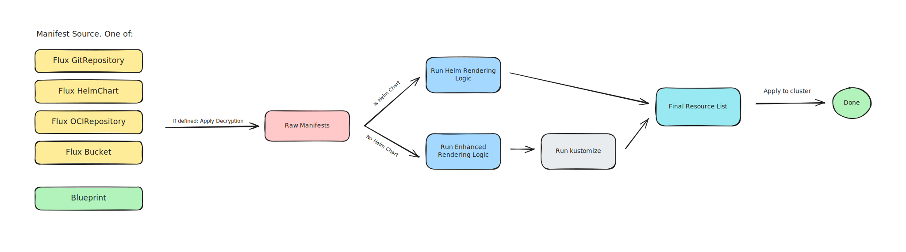

Welcome to the Component Operator documentation.

Component Operator helps you manage Kubernetes components consistently using a unified approach for Helm Charts, Kustomizations, and plain manifests.

Manifests can be provided as regular Helm Charts, or as plain manifests or Kustomizations, optionally templated using our enhanced templating syntax. Manifests can be encrypted by [SOPS](https://github.com/getsops/sops) using GPG or [age](https://github.com/filosottile/age). Objects can be referenced via the usual FluxCD source types
- `GitRepository`
- `HelmChart`
- `OCIRepository`
- `Bucket`

or using our own in-cluster `Blueprint` resource:

The source type (Helm Chart or not) is automatically detected, and the matching renderer is applied. Finally, the rendered manifests are applied to the Kubernetes cluster in a uniform way.